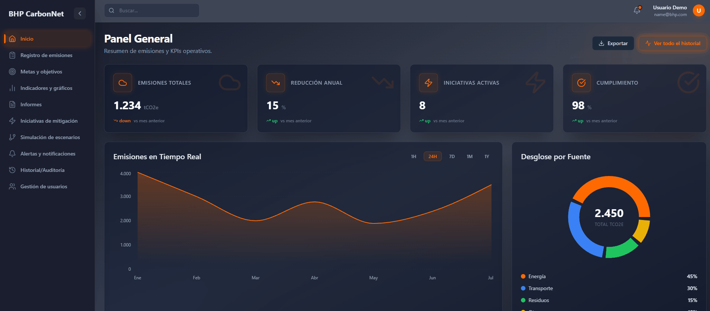

# BHP CarbonNet (Prototipo Web)

Este proyecto es un **prototipo de alta fidelidad** desarrollado como parte del curso de **Gestión de Proyectos Informáticos**. Su objetivo es demostrar la interfaz visual y el flujo de usuario de la plataforma CarbonNet.

Esta aplicación es **exclusivamente Frontend**. No cuenta con una base de datos real ni lógica de backend. Todas las acciones (guardar, eliminar, simular) son simulaciones visuales para demostrar la funcionalidad propuesta.

## Visualización en Vercel



La aplicación se encuentra desplegada y accesible públicamente en Vercel.

1.  **Acceso**: Ingresa a la URL del despliegue en Vercel (Visible en el mismo repositorio).
2.  **Inicio de Sesión**:
    *   El sistema de autenticación es **simulado**.
    *   Puedes ingresar **cualquier correo electrónico** y **cualquier contraseña**.
    *   Haz clic en "Iniciar Sesión" para acceder al Dashboard.

## Instalación y Ejecución Local

### Prerrequisitos
*   Node.js (versión 18 o superior recomendada)
*   Git

### Pasos

1.  **Clonar el repositorio**:
    ```bash
    git clone <URL_DEL_REPOSITORIO>
    cd CarbonNet
    ```

2.  **Instalar dependencias**:
    ```bash
    npm install
    ```

3.  **Ejecutar el servidor de desarrollo**:
    ```bash
    npm run dev
    ```

4.  **Abrir en el navegador**:
    La consola te mostrará una URL local. Ábrela en tu navegador web.

## Tecnologías

*   **React**
*   **TypeScript**
*   **Tailwind CSS**
*   **Vite**
